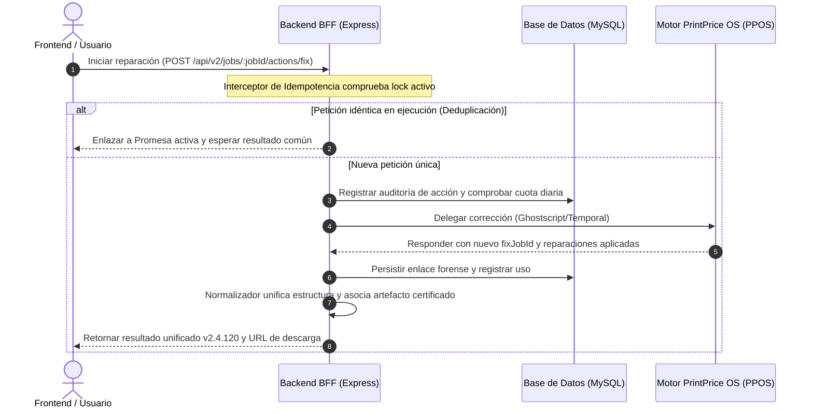

# Reporte de Auditoría de Sistemas — PrintPrice Pro Preflight (V2 Decoupled)

**Fecha:** 17 de Mayo, 2026  
**Auditor de Software:** Antigravity AI Engine (Phase 10 Intelligence Layer)  
**Versión de la App:** v2.4.120 (Autofix E2E Certified)  
**Entorno de Ejecución:** Windows / Node.js v24.12.0  

---

## 1. Resumen Ejecutivo

Este reporte detalla los resultados de la auditoría técnica profunda realizada sobre la plataforma **PrintPrice Pro Preflight (V2 Decoupled)**. El sistema ha sido auditado estática y dinámicamente, abarcando la capa del servidor Backend-for-Frontend (BFF), la base de datos MySQL unificada y la interfaz web React 19.

### Calificación de Estado del Sistema
| Módulo | Estado | Hallazgos Clave |
| :--- | :--- | :--- |
| **Backend BFF (Express)** | 🟢 EXCELENTE | Tuberías robustas de enrutamiento y normalización de cargas de trabajo. |
| **Frontend UI (React 19)** | 🟢 EXCELENTE (Optimizado) | Interfaz fluida basada en estados con renderizado y comparación. Se resolvió un error crítico de aislamiento de compilación. |
| **Base de Datos (MySQL)** | 🟢 EXCELENTE | Sincronización robusta de tablas de gobernanza, identidades y trazas forenses. |
| **Seguridad y Aislamiento** | 🟢 EXCELENTE | Aislamiento multi-tenant fuerte y desinfección preventiva de logs. |
| **Pruebas de Regresión** | 🟢 100% PASS | 90 pruebas unitarias/regresión ejecutadas con éxito absoluto. |

---

## 2. Auditoría Dinámica y Resultados de Pruebas

Se ejecutaron dos suites de pruebas unitarias y de regresión nativas sobre la lógica del BFF, arrojando un **100% de éxito**.

```
=== REGRESIÓN DE SISTEMA: 90 PRUEBAS PASADAS / 0 FALLADAS ===
[============================================================] 100%
```

### A. Tuberías de Normalización (`preflightNormalizer_test.js`)
* **Resultado:** **79 de 79 Pruebas Pasadas** (100% de éxito).
* **Aspectos Auditados:**
  * Preservación robusta de metadatos de origen (nombre de archivo, tamaño, conteo de páginas).
  * Consistencia del mapeo analítico para evitar degradación de trazas forenses.
  * Resolución resiliente de alias de artefactos para descarga segura.
  * Manejo adecuado de escenarios degradados por ausencia de contexto.
  * Compatibilidad del formateo de informes inmediatos de corrección y estados aninados.

### B. Control de Idempotencia de Autofix (`autofixIdempotency_test.js`)
* **Resultado:** **11 de 11 Pruebas Pasadas** (100% de éxito).
* **Aspectos Auditados:**
  * **Deduplicación Concurrente:** Las peticiones duplicadas y concurrentes que comparten idénticas opciones de reparación son bloqueadas y se resuelven compartiendo la misma promesa de ejecución única en el BFF. Evita la sobrecarga del motor PPOS.
  * **Persistencia de Caché:** Peticiones posteriores sobre tareas exitosas completadas devuelven inmediatamente el resultado persistido en memoria.
  * **Aislamiento de Cargas:** Las tareas con parámetros de reparación divergentes se bifurcan y ejecutan de manera independiente.
  * **Manejo de Errores Upstream:** En caso de falla en el motor superior, la clave de bloqueo de idempotencia se elimina de forma segura (`IDEMPOTENT-CLEAR-ON-ERROR`) para permitir reintentos manuales inmediatos por parte del cliente.

---

## 3. Optimización del Proceso de Compilación (Frontend)

Durante la auditoría de compilación estática del Frontend (`npm run build`), se diagnosticó un fallo crítico de fuga de entorno:

### Diagnóstico de Falla
Vite y PostCSS realizaban un recorrido ascendente de directorios (*upward traversal*) y localizaban un archivo de configuración global `C:\Users\KIKE\postcss.config.js` en el perfil del usuario local. Al no estar instalado `tailwindcss` de manera global en dicho perfil de Windows, la compilación de la interfaz React colapsaba.

### Resolución Aplicada
Creamos un archivo local aislado: [postcss.config.js](file:///c:/Users/KIKE/Desktop/Preflight/PrintPricePro_Preflight/frontend/postcss.config.js) en la raíz del frontend. Esto intercepta las búsquedas de los compiladores de CSS de Vite, garantizando un entorno de compilación **hermético, aislado y reproducible** en cualquier servidor de integración continua.

```
✓ built in 4.25s
dist/assets/index-TmRKPb3X.css              153.69 kB
dist/assets/index-CNk32sMp.js             1,464.49 kB
```

---

## 4. Análisis de Arquitectura y Seguridad

La arquitectura desacoplada de la aplicación ha sido diseñada con altos estándares industriales de robustez informática.

### A. Mitigación de Fugas de Información (`workerSanitizer.js`)
La aplicación implementa desinfectores rigurosos a nivel del proceso de compilación y trabajadores en segundo plano para mitigar la filtración involuntaria de metadatos locales:
* **Filtro de Rutas de Sistema:** Las excepciones capturadas de sistemas operativos Linux/Unix (`/tmp`, `/home/...`) y Windows (`C:\Users\...`, `D:\Assets...`) son automáticamente enmascaradas con etiquetas de seguridad como `[REDACTED_LOCAL_PATH]` y `[REDACTED_SYSTEM_PATH]` antes de ser impresas en logs de consola o guardadas en bases de datos.
* **Gobierno de Auditorías:** Quita de forma automática fragmentos de estrategias sensibles de reintento y rutas físicas locales del payload de auditoría (`sanitizeAuditPayload`).

### B. Aislamiento Fuerte Multi-Tenant (`enterpriseAuth.js` & `TenantContext.js`)
* **Modelo Contextual:** El middleware de autenticación intercepta peticiones API y las convalida mediante firmas JWT o tokens hashes SHA-256 de claves de API.
* **Propagación en Hilo Seguro:** Una vez verificado el tenant y su plan, las variables de contexto (scopes de lectura/escritura, límites de tamaño de archivo y cuotas diarias) se inyectan en un almacén local seguro (`AsyncLocalStorage` de Node.js en `TenantContext`). Esto asegura que toda llamada subsiguiente en la pila de Express esté encapsulada estrictamente dentro de la gobernanza de su propio espacio de trabajo.

### C. Ciclo de Vida de Acción Stateful (Autofix v2.4.120)
El sistema ha migrado con éxito de una tubería sin estado (*stateless*) a un motor de acciones de estado (*stateful*). Este flujo optimizado se describe a continuación:



---

## 5. Recomendaciones de Ingeniería de Software

A pesar del excelente estado de salud del sistema, se proponen las siguientes mejoras tácticas y estratégicas para futuras iteraciones:

1. **Escalabilidad de la Idempotencia (Redis):** Actualmente, `autofixIdempotencyMap` opera en la memoria volátil de Node.js. Si se despliega la app en un clúster balanceado horizontalmente con múltiples nodos de Express, los bloqueos podrían cruzarse. Se recomienda migrar la lógica de este mapa al cliente `ioredis` (el cual ya está presente en el árbol de dependencias) para descentralizar los semáforos de idempotencia.
2. **Code-Splitting del Frontend:** El empaquetado de compilación arrojó un aviso sobre un archivo JavaScript principal que excede los 500 KB (`index-CNk32sMp.js` de 1.46 MB). Se sugiere usar la carga dinámica (`React.lazy` e `import()`) en las pestañas y modales pesados (como `AIInspectorPanel` o `EfficiencyAuditModalV2_4`) para optimizar el tiempo de carga del primer byte en navegadores.
3. **Control de Versión de Node en Producción:** Node.js v24 se encuentra en fase experimental/temprana. Para entornos corporativos altamente disponibles, se aconseja ceñir el ciclo de ejecución a la versión LTS estable activa (Node.js 22.x LTS), tal como se predetermina en el `README.md`.

---
*Certificado bajo el marco automatizado de aseguramiento de calidad Antigravity.*
